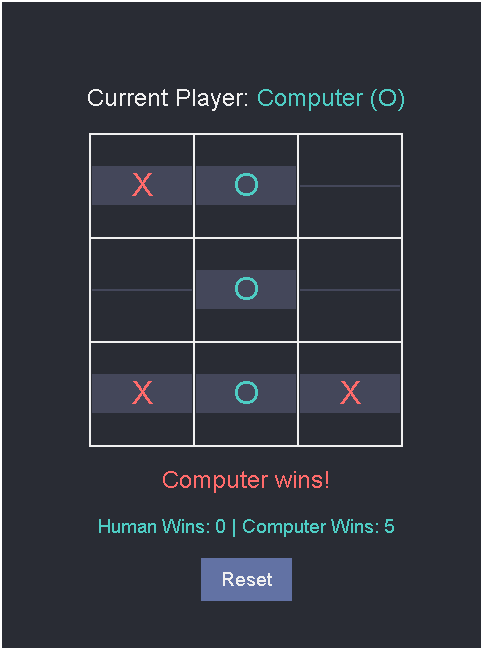

# TicBot

TicBot is a web-based Tic-Tac-Toe game where you can play against an AI opponent. The AI uses the Minimax algorithm to make optimal moves, ensuring a challenging game for the player.

## Developers

- **Algorithm**: [noth3m](https://github.com/noth3m)
- **Frontend & Backend**: [a3ro-dev](https://github.com/a3ro-dev)

## Project Overview

TicBot is built using Flask for the backend and HTML/CSS for the frontend. The game logic, including the AI opponent, is implemented in Python. The AI uses the Minimax algorithm to evaluate the best possible moves, making it a formidable opponent.

### Features

- **Human vs AI**: Play against the computer.
- **Minimax Algorithm**: The AI uses the Minimax algorithm to make optimal moves.
- **Score Tracking**: Keeps track of wins for both the human and the computer.
- **Reset Functionality**: Reset the game board at any time.

### How It Works

1. **Human Move**: The human player makes a move by clicking on the desired cell.
2. **AI Move**: The AI calculates the best move using the Minimax algorithm and makes its move.
3. **Win Check**: After each move, the game checks if there is a winner.
4. **Score Update**: The scores are updated based on the game outcome.
5. **Reset**: The game can be reset to start a new match.

### Example Output

Here is an example of the game interface:



## Getting Started

### Prerequisites

- Python 3.x
- Flask

### Installation

1. Clone the repository:
   ```bash
   git clone https://github.com/noth3m/TicBot
   cd ticbot
   ```

2. Install the required packages:
   ```bash
   pip install -r requirements.txt
   ```

3. Run the application:
   ```bash
   python app.py
   ```

4. Open your web browser and navigate to `http://127.0.0.1:5000/` to start playing.

## File Structure

- [`app.py`](command:_github.copilot.openRelativePath?%5B%7B%22scheme%22%3A%22file%22%2C%22authority%22%3A%22%22%2C%22path%22%3A%22%2FF%3A%2FTicBot%2Fapp.py%22%2C%22query%22%3A%22%22%2C%22fragment%22%3A%22%22%7D%5D "f:\TicBot\app.py"): Main application file.
- [`templates/index.html`](command:_github.copilot.openRelativePath?%5B%7B%22scheme%22%3A%22file%22%2C%22authority%22%3A%22%22%2C%22path%22%3A%22%2FF%3A%2FTicBot%2Ftemplates%2Findex.html%22%2C%22query%22%3A%22%22%2C%22fragment%22%3A%22%22%7D%5D "f:\TicBot\templates\index.html"): HTML template for the game interface.
- [`tictactoe.py`](command:_github.copilot.openRelativePath?%5B%7B%22scheme%22%3A%22file%22%2C%22authority%22%3A%22%22%2C%22path%22%3A%22%2FF%3A%2FTicBot%2Ftictactoe.py%22%2C%22query%22%3A%22%22%2C%22fragment%22%3A%22%22%7D%5D "f:\TicBot\tictactoe.py"): Contains the game logic and Minimax algorithm.

## Contributing

Contributions are welcome! Please fork the repository and create a pull request with your changes.

## License

This project is licensed under the [MIT License](./LICENSE). See the LICENSE file for details.

## Acknowledgements

- [Flask](https://flask.palletsprojects.com/) - Web framework used.
- [Minimax Algorithm](https://en.wikipedia.org/wiki/Minimax) - Algorithm used for AI decision making.

---